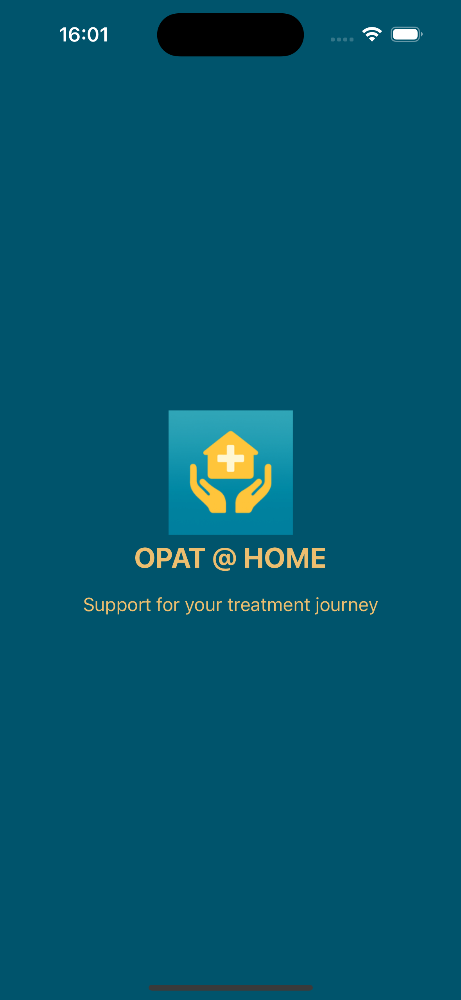
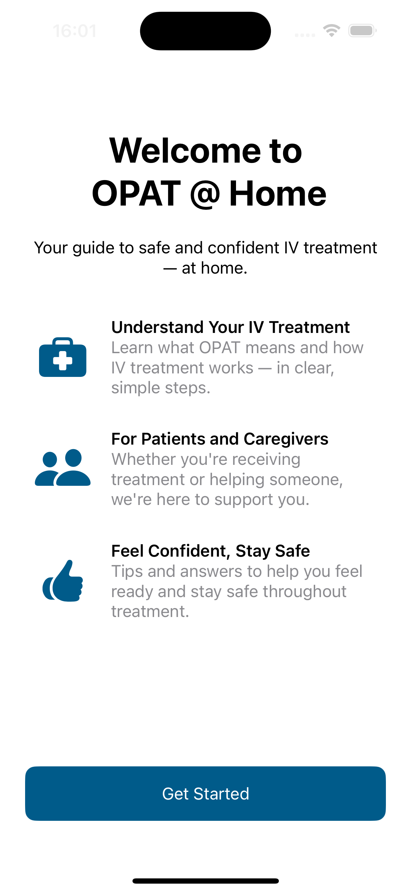
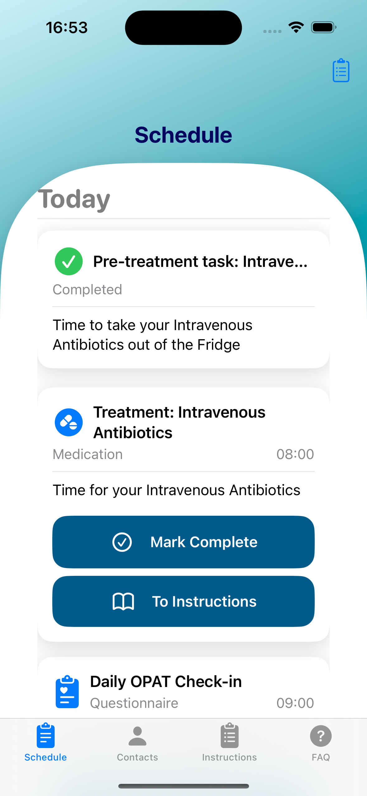
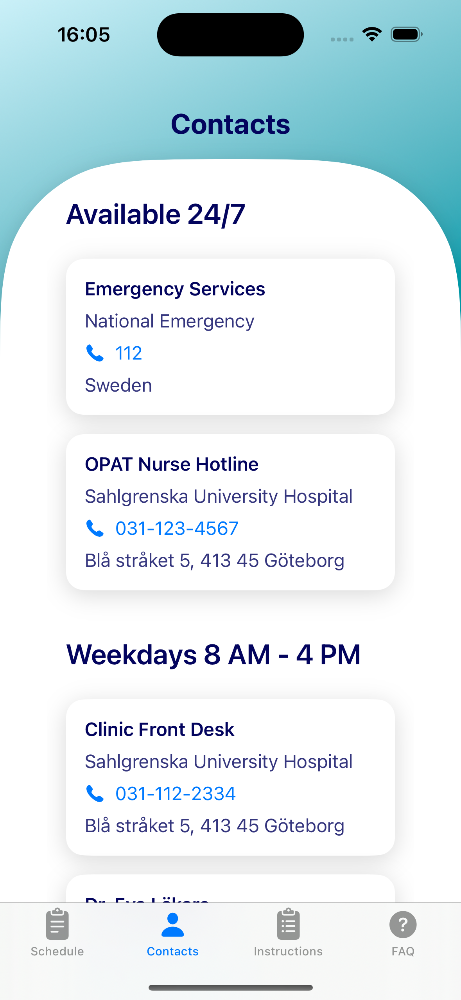
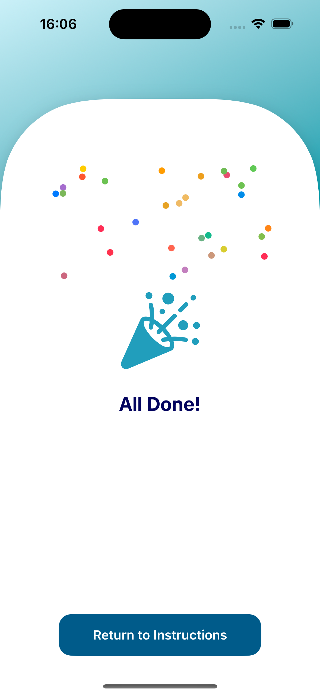
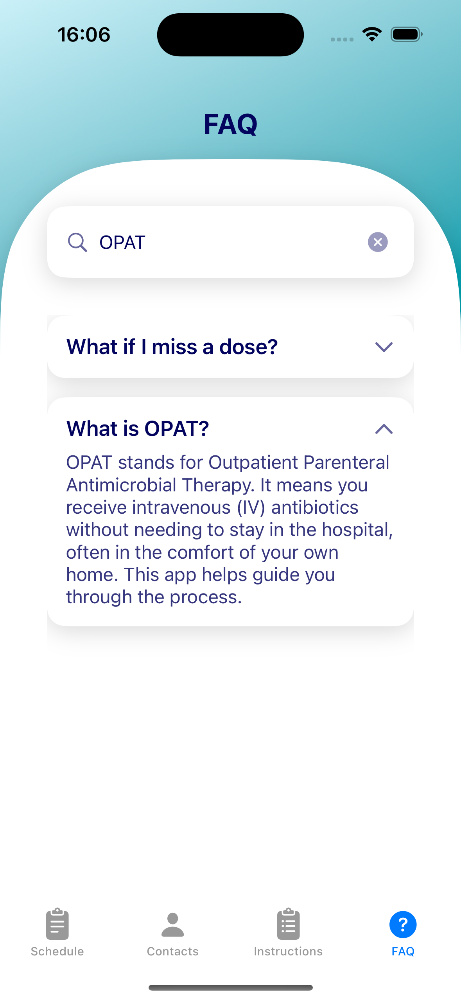

<!--
This source file is part of the OPAT @ Home project.

Based on the Stanford Spezi Template Application:
https://github.com/StanfordSpezi/SpeziTemplateApplication

SPDX-FileCopyrightText: 2023 Stanford University  
SPDX-License-Identifier: MIT
-->

# OPAT @ Home

**OPAT @ Home** is a digital health prototype designed to support patients receiving intravenous antibiotics at home through **Outpatient Parenteral Antimicrobial Therapy (OPAT)**.

The project’s goal is to increase patient confidence, independence, and safety when receiving intravenous treatment at home, while supporting the healthcare system’s shift toward more scalable, home-based care.

This prototype was developed as part of the [Digital Health Implementation](https://www.chalmers.se/en/education/your-studies/course-selection-and-registration/select-courses/choose-a-tracks-course/digital-health-implementation/) course at **Chalmers University of Technology**, with guidance from faculty at **Stanford University** and clinical input from healthcare professionals in Sweden and the UK. The app is built using Stanford’s [Spezi](https://github.com/StanfordSpezi/Spezi) framework.

---

## Key Features

- **Clear Educational Content**  
  Simple, accessible picture/text modules to guide patients through treatment tasks with step-based instructions.

- **Contact & Support Access**  
  Structured access to appropriate contacts (nurses, 1177, emergency).

- **FAQ Module** 
  Common questions answered clearly to build patient independence.

- **Daily Check-Ins**  
  Built-in self-monitoring to help patients reflect on symptoms and treatment progress. Designed with a future vision of structured clinical integration, enhancing both patient confidence and remote oversight.

---

## Prototype Demo (v1)

Here’s a quick preview of the prototype in action:

👉 [Watch demo on YouTube](https://youtube.com/shorts/mlTw7f_ffxE)  
*A quick walkthrough of key features*

---

## Screenshots

  
  
  
  
  
  

---

## Built With

- [Spezi Template Application](https://github.com/StanfordSpezi/SpeziTemplateApplication)
- Spezi FHIR / Questionnaire / Onboarding / Views
- SwiftUI

---

## Acknowledgements

This project builds on the [Stanford Spezi Template Application](https://github.com/StanfordSpezi/SpeziTemplateApplication) and incorporates several open-source [Spezi modules](https://github.com/StanfordSpezi).  
Special thanks to the [Stanford Biodesign Digital Health Group](https://biodesign.stanford.edu/) and the clinical experts from Sahlgrenska University Hospital, Oxford University Hospitals NHS Foundation Trust and Skåne University Hospital who provided valuable guidance and feedback during the design of this prototype.

---

## License

This project is licensed under the MIT License. See the [LICENSE](LICENSE) file for details.
