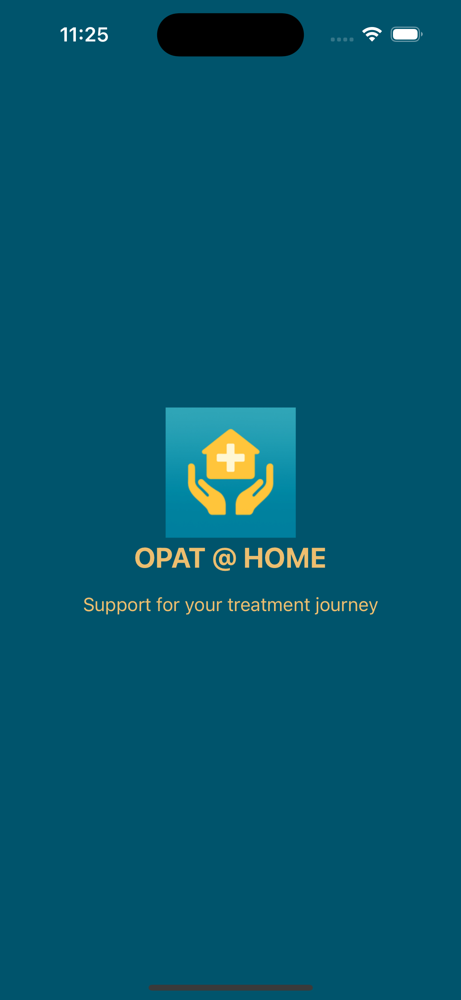
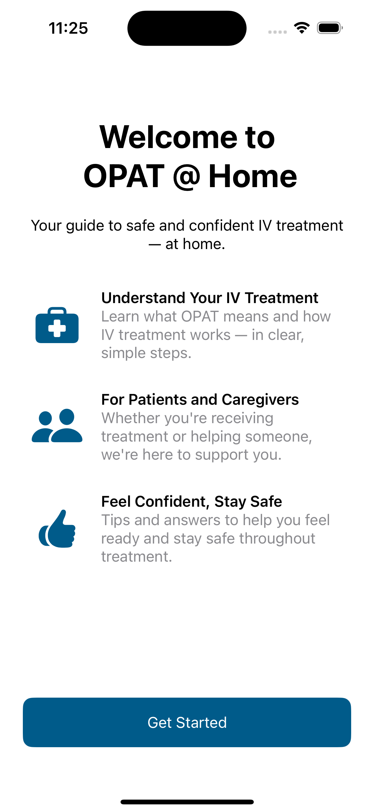
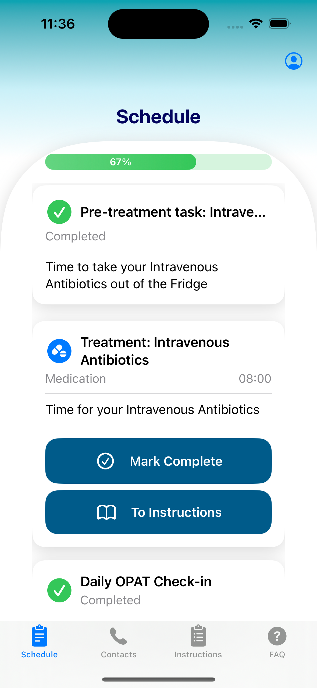
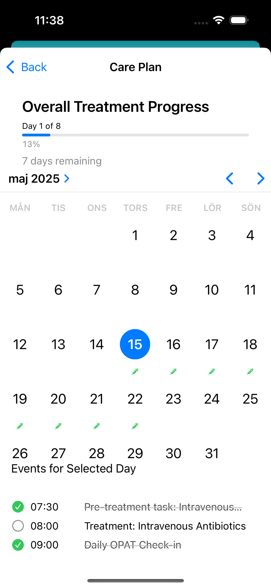
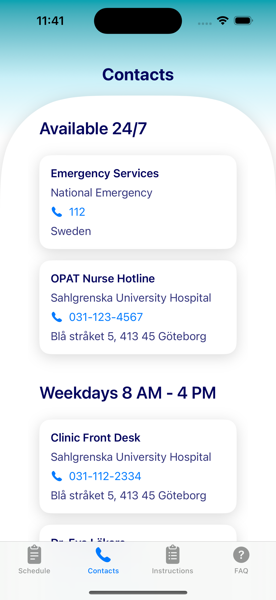
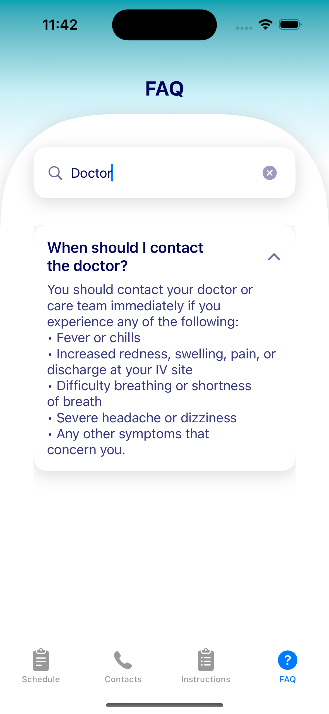

<!--
This source file is part of the OPAT@Home project.

Based on the Stanford Spezi Template Application:
https://github.com/StanfordSpezi/SpeziTemplateApplication

SPDX-FileCopyrightText: 2023 Stanford University  
SPDX-License-Identifier: MIT
-->

# OPAT@Home

**OPAT@Home** is a digital health prototype designed to support patients receiving intravenous antibiotics at home through **Outpatient Parenteral Antimicrobial Therapy (OPAT)**.

The project’s goal is to increase patient confidence, independence, and safety when receiving intravenous treatment at home, while supporting the healthcare system’s shift toward more scalable, home-based care.

This prototype was developed as part of the [Digital Health Implementation](https://www.chalmers.se/en/education/your-studies/course-selection-and-registration/select-courses/choose-a-tracks-course/digital-health-implementation/) course at **Chalmers University of Technology**, with guidance from faculty at **Stanford University** and clinical input from healthcare professionals in Sweden and the UK. The app is built using Stanford’s [Spezi](https://github.com/StanfordSpezi/Spezi) framework.

---

## Key Features (Prototype v2)

- **Onboarding & Welcome Flow**  
  Introduces OPAT and the home treatment steps in a clear, patient-friendly manner.

- **Daily Treatment Schedule & Progress Tracker**  
  Today's tasks, pre-treatment steps, and infusion events, with visual progress tracking.

- **Step-by-Step Infusion Guide (Prototype)**  
  Prototype of the future step-based instructional flow for infusion tasks.

- **Daily Check-Ins**  
  Built-in self-monitoring to help patients reflect on symptoms and treatment progress.  
  Designed with a future vision of structured clinical integration, enhancing both patient confidence and remote oversight.

- **Contact & Support Access**  
  Easy access to contacts for clinic nurses, emergency services, and support.

- **FAQ & Search Module**  
  Searchable FAQ module to support patient independence and understanding.

---

## Prototype Demo (v2)

Here’s a quick preview of the latest prototype:

👉 [Watch v4 demo on YouTube](https://youtu.be/oUz5PCKAk6c)  
*A walkthrough of the v4 prototype – the build used in Final course presentation of the prototype*

---

## Screenshots (Prototype v2)

The following screenshots highlight core features of the **OPAT@Home prototype v2**.

|  |  |  |
|:--:|:--:|:--:|
| Splash Screen | Welcome / Onboarding | Schedule View |

|  |  |  |
|:--:|:--:|:--:|
| Care Plan Overview | Contact Module | FAQ Module |

---

📜 Prototype Demos (v1 & v2) (Historical Reference)

### Prototype Demo (v1)

👉 [Watch v1 demo on YouTube](https://youtube.com/shorts/mlTw7f_ffxE)  

👉 [Watch v2 demo on YouTube](https://youtube.com/shorts/YVcvpVbuJEw)  

---

## Built With

- [Spezi Template Application](https://github.com/StanfordSpezi/SpeziTemplateApplication)
- Spezi Modules (e.g. SpeziQuestionnaire, SpeziOnboarding, SpeziViews, SpeziNotifications)
- SwiftUI

---

## Acknowledgements

This project builds on the [Stanford Spezi Template Application](https://github.com/StanfordSpezi/SpeziTemplateApplication) and incorporates several open-source [Spezi modules](https://github.com/StanfordSpezi).  
Special thanks to the [Stanford Biodesign Digital Health Group](https://biodesign.stanford.edu/) and the clinical experts from Sahlgrenska University Hospital, Oxford University Hospitals NHS Foundation Trust, and Skåne University Hospital who are providing valuable guidance and feedback during the design of this prototype.

---

## License

This project is licensed under the MIT License. See the [MIT License](LICENSES/MIT.txt) file for details.

